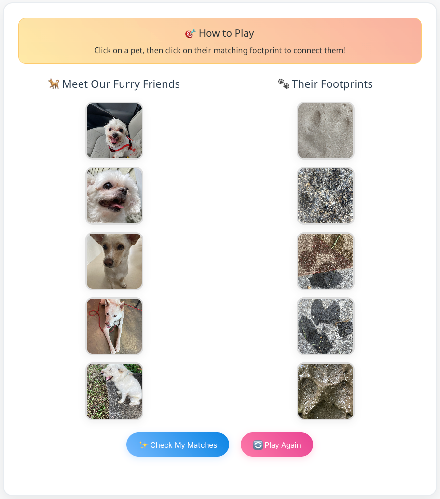

# PawPrint: Whose Footprints Are These? Identifying Animal Individuals by Their Footprints

[](https://arxiv.org/abs/2505.17445)
[](https://songinpyo.github.io/PawPrint-Project/)
[](https://2025.ieeeicip.org/)

We strongly recommend to use the [Project Page](https://songinpyo.github.io/PawPrint-Project/) for interactive visualization of the dataset.

And you can also download the dataset [here](https://songinpyo.github.io/PawPrint-Project/).



## 🎯 Abstract

In the United States, as of 2023, pet ownership has reached 66% of households and continues to rise annually. This trend underscores the critical need for effective pet identification and monitoring methods, particularly as nearly 10 million cats and dogs are reported stolen or lost each year. However, traditional methods for finding lost animals like GPS tags or ID photos have limitations—they can be removed, face signal issues, and depend on someone finding and reporting the pet. To address these limitations, we introduce PawPrint and PawPrint+, the first publicly available datasets focused on individual-level footprint identification for dogs and cats.

## 📊 Datasets

We introduce two datasets:
- **PawPrint**: Individual-level footprint identification dataset for both dogs and cats
- **PawPrint+**: Extended dataset with enhanced annotations and diverse environmental conditions

[Download Dataset](https://songinpyo.github.io/PawPrint-Project/)

### Dataset Structure
```
data/PawPrint/
├── PP/                    # PawPrint dataset
│   ├── train/
│   │   ├── cat/
│   │   │   └── cat_{name}/
│   │   │       └── {num}_{env}.png
│   │   └── dog/
│   │       └── dog_{name}/
│   │           └── {num}_{env}.png
│   └── test/
│       ├── cat/
│       └── dog/
└── PP+/                   # PawPrint+ dataset
    ├── train/
    └── test/
```

## 🚀 Quick Start

### Installation

1. Clone the repository:
```bash
git clone https://github.com/songinpyo/PawPrint-ICIP2025.git
cd PawPrint-ICIP2025
```
2. Create a conda environment:  
```bash
conda create -n pawprint python=3.10
conda activate pawprint
```

3. Install dependencies:
```bash
pip install -r requirements.txt
```

4. Download the datasets from the [project page](https://songinpyo.github.io/PawPrint-Project/) and place them in the `data/` directory.

### Training

Train a model using the provided configuration files:

```bash
# Train ResNet50 with full fine-tuning
python train_pawprint.py --config configs/pawprint/resnet50_full_tuning.yaml

# Train with SIFT local features
python train_pawprint.py --config configs/pawprint/resnet50_full_sift.yaml

# Train with metric learning (ArcFace)
python train_pawprint.py --config configs/pawprint/resnet50_arcface_sift.yaml
```

### Evaluation

Evaluate a trained model:

```bash
python eval_pawprint.py \
    --checkpoint checkpoints/your_model_best.pth \
    --data-dir ./data/PawPrint \
    --save-dir ./eval_results \
    --batch-size 32
```

## 🏗️ Model Architecture

Our framework supports:
- **Deep Neural Networks**: CNN backbones (ResNet, EfficientNet), Vision Transformers (ViT, Swin)
- **Local Features**: SIFT, ORB with learnable aggregation
- **Metric Learning**: Center Loss, ArcFace Loss
- **Hybrid Approaches**: Combination of deep neural networks and local features

## 📁 Repository Structure

```
PawPrint-ICIP2025/
├── configs/               # Configuration files
│   ├── base.yaml         # Base configuration
│   └── pawprint/         # Experiment-specific configs
├── models/               # Model implementations
│   ├── backbone.py       # CNN and ViT backbones
│   ├── local_feature.py  # Local feature models
│   └── metric_learning.py # Metric learning losses
├── utils/                # Utility functions
├── data/                 # Dataset implementations (not included)
├── train_pawprint.py     # Training script
├── eval_pawprint.py      # Evaluation script
└── requirements.txt      # Dependencies
```

## 📈 Results

Through comprehensive benchmarking of both modern deep neural networks and classical local features, we observe varying advantages and drawbacks depending on substrate complexity and data availability. Our findings suggest promising directions for combining learned global representations with local descriptors to enhance reliability across diverse, real-world conditions.

## 🔗 Links

- **Paper**: [arXiv:2505.17445](https://arxiv.org/abs/2505.17445)
- **Project Page & Dataset**: [https://songinpyo.github.io/PawPrint-Project/](https://songinpyo.github.io/PawPrint-Project/)
- **Conference**: [ICIP 2025](https://2025.ieeeicip.org/)

## 📝 Citation

If you use our work in your research, please cite:

```bibtex
@article{song2025pawprint,
  title={PawPrint: Whose Footprints Are These? Identifying Animal Individuals by Their Footprints},
  author={Song, Inpyo and Hwang, Hyemin and Lee, Jangwon},
  journal={arXiv preprint arXiv:2505.17445},
  year={2025}
}
```